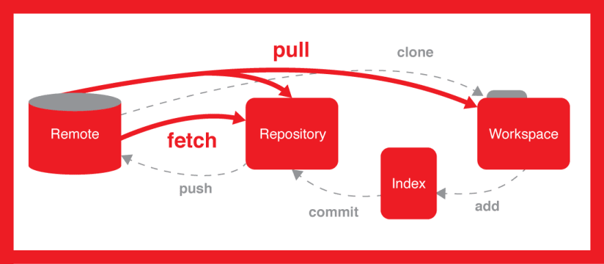

## What is Git and GitHub?

- Git is a **distributed version control** software (°2005)
- Git is the software on which GitHub, GitLab, Bitbucket, ... rely.
- GitHub is where a lot of the software you use is maintained and developed.

## Why you might want to use/understand Git and GitHub

- It is **Track Changes** for your coding.
- You can **roll back** to any point in time.
- You can **collaborate** on code while offline.
- Everything is on GitHub. You might as well be too.

## What I use it for specifically

- Backup my coding, notes and pdfs: files and history
- Searching through old code
- Looking at the source code of R-packages
- Raising issues to the developers of R-packages

# Git

## Basic concept

Changes are tracked on a line-to-line basis.



Files that are not yet added are **Untracked**. Files that are added, but have changed, have **Unstaged** changes.

## Let's try that

We will:

- Make a new Git repository
- Create files in our workspace
- Add them to our index
- Commit them to our local repository
- Add a remote GitHub repository to it
- Push them to the remote repository on GitHub

## Credentials

Edit the following and paste it in your command line environment. Press enter.

```bash
git config --global credential.helper store
git config --global user.email "your.email@email.com"
git config --global user.name  "Your name"
git config --global init.defaultBranch main
```

This will write your configurations in `~/.gitconfig` and your credentials in `~/.git-credentials`. Make sure the latter is never publicly available, it is not encrypted.

On GitHub, from your profile pictures, go to settings, choose "Developer options", "Personal access tokens", "Tokens (classic)", and choose "Generate new token (classic)".

Give it a relevant name (e.g. device you are using), set the desired expiration, and check the "repo" box. Create the token and copy and paste it somewhere for later.

## User interface

Git can be used either through:

- A command line interface
- A graphical user interface

We start with the command line interface, because it demystifies what is happening underneath.

## Help!

Open Git Bash.

`git` is the command which does all the work. If you want more information on what this command can do and how you can use it:

```bash
git --help
```

## init

Create a new directory, and in that directory right click and choose the option "Git Bash here"

```bash
git init
```

This turns your workspace into a git repository and creates a `.git` directory to store all git related files.

## Hidden items

There are a lot of hidden items on your computer. An item is hidden when it starts with a "."

Most of the time these files are configurations.

In file explorer, Choose "View", "Show/hide", and check "hidden items".

## status

```bash
git status
```

Check the status of your git repository.

## Create a readme file

```md
# This is a title

## This is a heading

This is text.

## This is another heading

This is some other text.
```

## add

We can now add the file to our index. It is not yet part of our git repository.

```bash
git add filename
```

or, if you want to add everything:

```bash
git add .
```

You can also remove files from your index using `git rm`.

## commit

Once we have a set of changes that we want to commit to our git repository, make sure all is correct using `git status`, then:

```bash
git commit
``` 

! This will open a terminal text editor ! 
Most likely vi(m). If you want to exit: ESC and ":q"

If you want to avoid using a terminal text editor:

```bash
git commit -m "my message"
``` 

Make sure to keep this message short.

## Creating and adding a remote repository

On GitHub, click on the "+" next to your profile picture, and create a new repository. Choose a name, write a description, and set if you want it to be public or private.

Once created, you get two code snippets: one for if you want to clone this new repository, the other one for if you want to push an existing repository. We choose the second option. 

Copy the code snippet, paste it in your command line environment and execute it. 

## push

Now that we have a remote repository, we can push our local repository to it:

```bash
git push 
``` 

You will need to paste your access token from earlier here.

Check on GitHub if your push got through.

## fetch & pull

If your remote repository has changes, you can use `git fetch` to see what those changes are. If you want to integrate those changes in your local workspace, you can use `git pull`.

## Using a GUI

Almost all IDE's integrate Git:

- Rstudio
- VSCode
- ...

There are a lot of different ways to interact with git, but they do the same thing as we did in the command line.

## Adding existing larger project

Git is not meant to deal with large files. **50 MB is the limit** for what you want to push.

If you have large files, like data, you want to exclude them in the `.gitignore` file.

```bash
data/
*.txt
test.R
```

This will exclude the whole data directory, all files ending in `.txt` even in subdirectories, and all `test.R` files even in subdirectories.

## Getting rid of Git

If you delete the `.git` directory, you have succeeded.

## Cloud storage mishaps

OneDrive can break your git repositories.

Your files will be fine, but you might run into push-pull problems.

## Other features of Git

- Cloning
- Diffing
- Stashing
- Merging
- Branching

## How I use it

I write most things in plain text format:

- `.md`, `.R`, `.Rmd`, `.org`, `.bib`, `.csv` ...

But also system configurations and paper pdfs.

Things I want to keep track of are in a git repository. I git add commit push every so often when I think of it. For me it is more about having a continuous process backup.

```bash
git add .
git commit -m "short message"
git push
``` 

# GitHub

## Github

"Where the world builds software"

Features I want to highlight:

- Searching
- Issues

## Searching code

You can see all the code from your favourite R package, or your own project.

Search through all their code and history.

## Issues

Like StackOverflow, but more up-to-date, and it's the developer answering.

## Open Science

GitHub is a great way to make your code available. Mind the limitation on data size however.

Powerful combo: **Git and Targets R package**.

## FNL code sharing

Nobody uses the `K:` drive. Especially not for coding.

If more people would use Git and GitHub, sharing code, and collaborating in the office would be a lot easier

- Searching
- History
- Author
- Changing

# Git: Multiplayer Notepad

The end

## Further resources

- Git tutorial for R users: https://happygitwithr.com/
